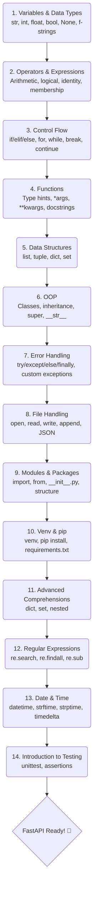

# Python Learning — Zero to FastAPI

A structured Python revision covering all core concepts needed before learning FastAPI.

---

## 🗺️ Learning Roadmap



---

## 📋 Topics Covered

| Status | File                                  | Topic                   | Key Concepts                                               |
| :----: | ------------------------------------- | ----------------------- | ---------------------------------------------------------- |
|   ✅   | `topic1_variables_and_datatypes.py`   | Variables & Data Types  | str, int, float, bool, None, f-strings, ternary            |
|   ✅   | `topic2_operators_and_expressions.py` | Operators & Expressions | Arithmetic, comparison, logical, identity, membership      |
|   ✅   | `topic3_control_flow.py`              | Control Flow            | if/elif/else, for, while, break, continue, match           |
|   ✅   | `topic4_functions.py`                 | Functions               | Type hints, default params, \*args, \*\*kwargs, docstrings |
|   ✅   | `topic5_data_structures.py`           | Data Structures         | list, tuple, dict, set                                     |
|   ✅   | `topic6_oop.py`                       | OOP                     | Classes, inheritance, super(), **str**                     |
|   ✅   | `topic7_error_handling.py`            | Error Handling          | try/except/else/finally, custom exceptions                 |
|   ✅   | `topic8_file_handling.py`             | File Handling           | open, read, write, JSON                                    |
|   ✅   | `topic9_modules_and_packages.py`      | Modules & Packages      | import, **init**.py, project structure                     |
|   ✅   | `topic10_venv_and_pip.py`             | Venv & pip              | virtualenv, pip, requirements.txt                          |
|   ✅   | `topic11_advanced_comprehensions.py`  | Advanced Comprehensions | dict, set, nested comprehensions                           |
|   ✅   | `topic12_regular_expressions.py`      | Regular Expressions     | re.search, re.findall, re.sub, match groups                |
|   ✅   | `topic13_date_and_time.py`            | Date & Time             | datetime, strftime, strptime, timedelta                    |
|   ✅   | `topic14_introduction_to_testing.py`  | Introduction to Testing | unittest, test cases, assertions                           |

## 📂 Project Structure

```text
python-work/
├── topic1_variables_and_datatypes.py
├── topic2_operators_and_expressions.py
├── topic3_control_flow.py
├── topic4_functions.py
├── topic5_data_structures.py
├── topic6_oop.py
├── topic7_error_handling.py
├── topic8_file_handling.py
├── topic9_modules_and_packages.py
├── topic9_package/
│   ├── __init__.py
│   └── math_utils.py
├── topic10_venv_and_pip.py
├── topic11_advanced_comprehensions.py
├── topic12_regular_expressions.py
├── topic13_date_and_time.py
├── topic14_introduction_to_testing.py
└── README.md
```

---

## 🛠️ Setup

```bash
# Clone the repo
git clone https://github.com/varunsahukar/python-work-.git
cd python-work-

# Create virtual environment
python -m venv venv
source venv/bin/activate  # Mac/Linux
venv\Scripts\activate     # Windows

# Run any file
python topic1_variables_and_datatypes.py
```

---

## ✨ Key Habits Built Today

- **Type hints** on every variable and function
- **Docstrings** on every function
- **Return values** from functions (don't just print)
- **Error handling** (try/except)
- **Clean naming** (snake_case)
- **PEP 8** compliance
- **Guard clauses** for clean logic
- **f-strings** for formatting
- **Indentation** (consistent 4 spaces)
- **venv always** (never work globally)

---

## 📚 Useful Resources

- [Official Python Documentation](https://docs.python.org/3/)
- [FastAPI Documentation](https://fastapi.tiangolo.com/)
- [PEP 8 Style Guide](https://peps.python.org/pep-0008/)

---

## 🚀 Goal

Complete Python foundation → **FastAPI Ready!** 🚀

---

## 📜 License

This project is open-source and available under the [MIT License](LICENSE).
