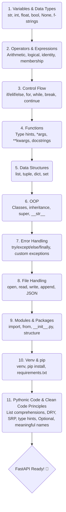

# Python Learning — Zero to FastAPI

A structured Python revision covering all core concepts needed before learning FastAPI.

---

## 🗺️ Learning Roadmap



---

## 📋 Topics Covered

| Status | File | Topic | Key Concepts |
|:---:|------|-------|--------------|
| ✅ | `topic1_variables_and_datatypes.py` | Variables & Data Types | str, int, float, bool, None, f-strings, ternary |
| ✅ | `topic2_operators_and_expressions.py` | Operators & Expressions | Arithmetic, comparison, logical, identity, membership |
| ✅ | `topic3_control_flow.py` | Control Flow | if/elif/else, for, while, break, continue, match |
| ✅ | `topic4_functions.py` | Functions | Type hints, default params, *args, **kwargs, docstrings |
| ⏳ | _coming soon_ | Data Structures | list, tuple, dict, set |
| ⏳ | _coming soon_ | OOP | Classes, inheritance, super(), __str__ |
| ⏳ | _coming soon_ | Error Handling | try/except/else/finally, custom exceptions |
| ⏳ | _coming soon_ | File Handling | open, read, write, JSON |
| ⏳ | _coming soon_ | Modules & Packages | import, __init__.py, project structure |
| ⏳ | _coming soon_ | Venv & pip | virtualenv, pip, requirements.txt |
| ⏳ | _coming soon_ | Clean Code | DRY, SRP, list comprehensions, Optional |

## 📂 Project Structure

```text
python-work/
├── topic1_variables_and_datatypes.py
├── topic2_operators_and_expressions.py
├── topic3_control_flow.py
├── topic4_functions.py
└── README.md
```

---

## 🛠️ Setup

```bash
# Clone the repo
git clone https://github.com/varunsahukar/python-work-.git
cd python-work-

# Create virtual environment
python -m venv venv
source venv/bin/activate  # Mac/Linux
venv\Scripts\activate     # Windows

# Run any file
python topic1_variables_and_datatypes.py
```

---

## ✨ Key Habits Built Today

- **Type hints** on every variable and function
- **Docstrings** on every function
- **Return values** from functions (don't just print)
- **Error handling** (try/except)
- **Clean naming** (snake_case)
- **PEP 8** compliance
- **Guard clauses** for clean logic
- **f-strings** for formatting
- **Indentation** (consistent 4 spaces)
- **venv always** (never work globally)

---

## 📚 Useful Resources

- [Official Python Documentation](https://docs.python.org/3/)
- [FastAPI Documentation](https://fastapi.tiangolo.com/)
- [PEP 8 Style Guide](https://peps.python.org/pep-0008/)

---

## 🚀 Goal

Complete Python foundation → **FastAPI Ready!** 🚀

---

## 📜 License

This project is open-source and available under the [MIT License](LICENSE).
